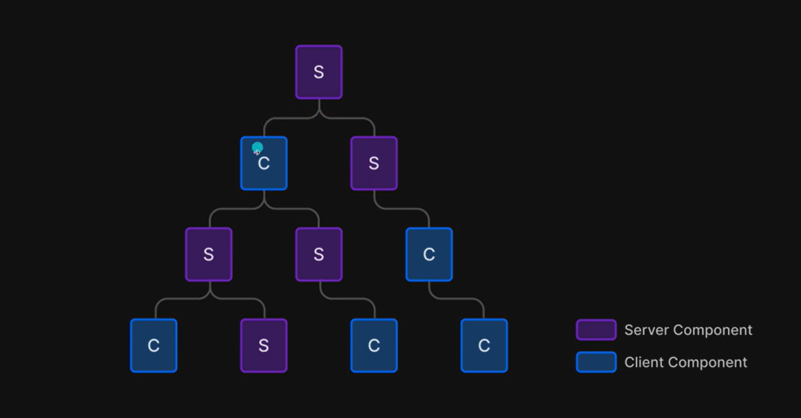
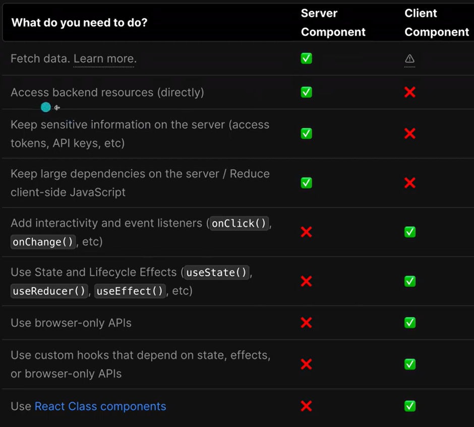

### Nextjs 13 - OpenTable

https://www.youtube.com/@nextjstutorial/playlists

### downloads files

https://www.dropbox.com/sh/9829qh4ad4kpkj8/AAA8aklsKsN9HTxkc9r8SYBla

source-code - folder "downloads"

### Pages

| page                                        | html                       |
| ------------------------------------------- | -------------------------- |
| opentable.ca                                | homepage.html              |
| opentable.ca/search                         | searchPage.html            |
| opentable.ca/restaurant/shakeshack          | restaurantDetailsPage.html |
| opentable.ca/restaurant/**shakeshack**/menu | restaurantMenuPage.html    |
| opentable.ca/reserve/**shakeshack**         | reservationPage.html       |

### Server Components and Client Components



### Components difference



### Seed

Instalar e configurar package.json

```json
{
  "name": "my-project",
  "version": "1.0.0",
  "prisma": {
    "seed": "ts-node --compiler-options {\"module\":\"CommonJS\"} prisma/seed.ts"
  },
  "devDependencies": {
    "@types/node": "^14.14.21",
    "ts-node": "^9.1.1",
    "typescript": "^4.1.3"
  }
}
```

Executar a carga

```shell
npx prisma db seed
```
